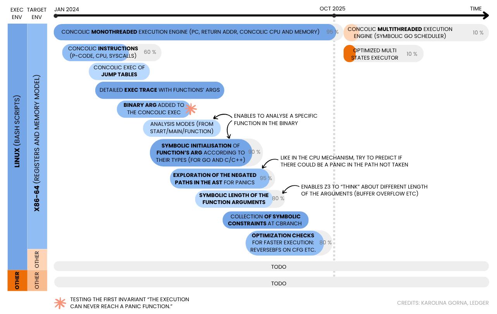

<!--
SPDX-FileCopyrightText: 2025 Ledger https://www.ledger.com - INSTITUT MINES TELECOM

SPDX-License-Identifier: Apache-2.0
-->

<div align="center">
  
</div>

<br>

<p align="center">
  <a href="LICENSE"></a>
  
  <a href="https://www.rust-lang.org/"></a>
  
</p>

ZORYA VOLOS IS A FORK OF ZORYA OWNED AND MAINTAINED BY KEITH MAKAN SECURITY CONSULTANCY (PTY) LTD

What KMSEC has added:
- volos memory interaction tracking system

```
[VOLOS DETECTOR] DATA RACE FOUND AT 0x1f948
----------------------------------------------------------------
Access 1:
  Goroutine ID: 371053
  Op Type:      Write
  Locks Held:   [5843280]
--- VS ---
Access 2:
  Goroutine ID: 371056
  Op Type:      Write
  Locks Held:   NONE (UNPROTECTED)
----------------------------------------------------------------
REASON: One or more threads accessed this memory without a shared lock.
================================================================

[VOLOS] READ MEM @[0x572E50] <= [32, 59, 87, 0, 0, 0, 0, 0] #Volos { thread_id: 371056, access_type: Read, locks_held: [] }
[VOLOS] READ MEM @[0x573C2F] <= [2] #Volos { thread_id: 371056, access_type: Read, locks_held: [] }
[VOLOS] WRITE MEM @[0x573C2F] <= ['[1]'] Volos { thread_id: 371056, access_type: Write, locks_held: [] }
[VOLOS] READ MEM @[0x573C2F] <= [1] #Volos { thread_id: 371056, access_type: Read, locks_held: [] }
[VOLOS] READ MEM @[0x7FFFFFFFD7E0] <= [24, 216, 255, 255, 255, 127, 0, 0] #Volos { thread_id: 371056, access_type: Read, locks_held: [] }
[VOLOS] READ MEM @[0x7FFFFFFFD7E8] <= [120, 215, 67, 0, 0, 0, 0, 0] #Volos { thread_id: 371056, access_type: Read, locks_held: [] }
[VOLOS] READ MEM @[0x572F00] <= [0, 0, 0, 0, 0, 0, 0, 0] #Volos { thread_id: 371056, access_type: Read, locks_held: [] }
[VOLOS] READ MEM @[0x7FFFFFFFD828] <= [70, 234, 75, 0, 0, 0, 0, 0] #Volos { thread_id: 371056, access_type: Read, locks_held: [] }
[VOLOS] READ MEM @[0x7FFFFFFFD830] <= [1, 0, 0, 0, 0, 0, 0, 0] #Volos { thread_id: 371056, access_type: Read, locks_held: [] }
[VOLOS] WRITE MEM @[0x7FFFFFFFD7E8] <= ['[42, 216, 67, 0, 0, 0, 0, 0]'] Volos { thread_id: 371056, access_type: Write, locks_held: [] }
[VOLOS] READ MEM @[0x7FFFFFFFD7E8] <= [42, 216, 67, 0, 0, 0, 0, 0] #Volos { thread_id: 371056, access_type: Read, locks_held: [] }
arg_values.joinAddress: 44f1c0, Symbol: runtime.writeErrData -> data=0x4bea46 (reg=RAX @0x0), n=0x1 (reg=RBX @0x18)
[VOLOS] WRITE MEM @[0x7FFFFFFFD7E0] <= ['[24, 216, 255, 255, 255, 127, 0, 0]'] Volos { thread_id: 371056, access_type: Write, locks_held: [] }
[VOLOS] READ MEM @[0x7FFFFFFFD7E0] <= [24, 216, 255, 255, 255, 127, 0, 0] #Volos { thread_id: 371056, access_type: Read, locks_held: [] }
[VOLOS] WRITE MEM @[0x7FFFFFFFD7F0] <= ['[70, 234, 75, 0, 0, 0, 0, 0]'] Volos { thread_id: 371056, access_type: Write, locks_held: [] }
[VOLOS] READ MEM @[0x7FFFFFFFD7F0] <= [70, 234, 75, 0, 0, 0, 0, 0] #Volos { thread_id: 371056, access_type: Read, locks_held: [] }
[VOLOS] WRITE MEM @[0x7FFFFFFFD7F8] <= ['[1, 0, 0, 0]'] Volos { thread_id: 371056, access_type: Write, locks_held: [] }

```
Zorya is a **concolic execution framework** designed to detect **logic-related bugs, language-specific vulnerabilities, and identify new patterns of security issues mainly in Go binaries**. The analysis begins by generating CPU register and memory dumps using ```gdb```. Zorya loads these dumps to initialize execution from a specified starting address, ensuring a realistic and accurate representation of the program state.

The core methodology involves **translating binary code into Ghidra's raw P-Code**, a low-level intermediate representation, which is subsequently parsed for precise execution path analysis. Other programs like C programs can also be translated to P-Code.

Zorya's engine, implemented in Rust, uses the **Z3 SMT solver** and includes a state manager, CPU state, memory model, and virtual file system. It emulates P-Code instructions to track the execution and detect vulnerabilities in the analyzed binaries.

Zorya supports both concrete and symbolic data types, x86-64 instructions and syscalls, and manages the program counter. Zorya can analyze single-threaded and starts to analyze multi-threaded Go programs, with automatic thread state dumping and restoration for binaries compiled with the gc compiler. For detailed information about multi-threading support, see [Multi-threading.md](doc/Multi-threading.md).

> The owl sees what darkness keeps —
> Zorya comes, and nothing sleeps.

> 🚧 Zorya is under active development. Expect breaking changes.

## :inbox_tray: Install
Make sure to have Rust, Golang and Python properly installed. FYI, the project is beeing developped and maintained under a Linux Ubuntu distrubution.

```
git clone --recursive https://github.com/Ledger-Donjon/zorya
cd zorya
make ghidra-config    # if you don't have Ghidra nor Pyhidra
make all
```

## :wrench: Usage

### A. Interactive Usage (prefered)
Zorya provides a guided mode, so you don't need to remember the options or flags. It prompts you with questions to outline three typical scenarios:

- Standard Execution - Automatically detects the main function or entry point.
- Function-Specific Execution - Allows selecting and providing arguments for a specific function.
- Custom Execution - Lets you manually input an address and arguments for targeted analysis.

Given the absolute path to the binary you want to analyze ```<path>```, simply run:
```
zorya <path>
```
The prompt will ask you for the:
1. Source code language: go, c, or c++
2. Go compiler: tinygo or gc (only when go is selected)
3. Thread scheduling strategy: all-threads or main-only (only for Go GC binaries)
4. Analysis mode: start, main, function, or custom
5. Function address: If you chose function or custom modes
6. Binary arguments: If the binary expects arguments (optional)
7. Negating path execution: Whether to symbolically explore alternate branches (defaults to yes)

### B. Basic Command-Line Usage
To use Zorya in its basic form, you need the absolute path to the binary you wish to analyze (```<path>```) and the hexadecimal address where execution should begin (```<addr>```). You must then specify the execution mode (start, main, function, or custom) based on your chosen analysis strategy. Additionally, you can provide any necessary arguments to be passed to the binary:
```
zorya <path> --lang <go|c|c++> [--compiler <tinygo|gc>] --mode <start|main|function|custom> <addr> --arg "<arg1> <arg2>" [--negate-path-exploration|--no-negate-path-exploration] [--force-pty]

FLAG:
  --lang                        Specifies the language used in the source code (go/c/c++)
  --compiler                    When Go was chosen as 'lang', specifies the used compiler (tinygo or gc)
  --mode                        Specifies the strategy mode to determine the starting address for binary analysis. Options include:
                                      start → Use the binary's entry point
                                      main → Analyze the main function (main.main preferred in Go binaries)
                                      function → Specify a function address manually
                                      custom → Define an arbitrary execution address
  --negate-path-exploration    Enables symbolic exploration of negated paths (default behavior)
  --no-negate-path-exploration  Disables negated path exploration
  --force-pty                   Runs GDB inside a pseudo-terminal (PTY) so the target binary sees a real
                                terminal on its stdin/stdout. Required when the binary uses isatty() checks
                                that gate code paths you want to analyze (see notes below).

OPTION:
  --arg                         Specifies arguments to pass to the binary, if any (default is 'none').
```

Notes:
- If any flag is missing, Zorya will prompt you interactively to ask for it.
- The address ()```<addr>```) is mandatory when using function or custom modes.
- Arguments (--arg) are optional.
- The ```--negate-path-exploration``` flag enables alternate path exploration (symbolic branch negation) to increase code coverage. It is enabled by default unless explicitly disabled using ```--no-negate-path-exploration```, if the execution takes too much time for instance.
- The ```--force-pty``` flag is needed when the target binary checks whether its I/O streams are connected to a real terminal (via ```isatty()``` / Go's ```term.IsTerminal()```). By default, GDB runs the child process with pipes, so ```isatty()``` returns false and terminal-dependent code paths are skipped entirely during the GDB dump phase. When ```--force-pty``` is set, Zorya wraps every GDB session inside the Linux ```script``` command, which allocates a real pseudo-terminal (```/dev/pts/N```). The child process then sees a genuine TTY, and terminal-gated initialization runs normally. A concrete example is ```kubectl exec -it```, where terminal size monitoring is only initialized when stdout is a TTY — see [Go-Binary-Analysis.md](doc/Go-Binary-Analysis.md) for details.

## How to build your binary?
Zorya needs the binary to have the debug symbols to perform the complete analysis. Striped binaries could be also analyzed, but it required to disable many functionnalities of the tool.

For Go:
- ```tinygo build -gc=conservative -opt=0 .```
- ```go build -gcflags=all="-N -l" .```

## :mag_right: Try it out with our test binaries
You can run Zorya on precompiled binaries with TinyGo located in ```tests/programs```.
All the execution results can be found in ```results```, except the P-Code file which is in ```external/pcode-generator/results```.

```
$ zorya /absolute/path/to/zorya/tests/programs/crashme/crashme


███████╗ ██████╗ ██████╗ ██╗   ██╗ █████╗ 
╚══███╔╝██╔═══██╗██╔══██╗╚██╗ ██╔╝██╔══██╗
  ███╔╝ ██║   ██║██████╔╝ ╚████╔╝ ███████║
 ███╔╝  ██║   ██║██╔══██╗  ╚██╔╝  ██╔══██║
███████╗╚██████╔╝██║  ██║   ██║   ██║  ██║
╚══════╝ ╚═════╝ ╚═╝  ╚═╝   ╚═╝   ╚═╝  ╚═╝
    Next Generation Concolic Analysis

What is the source language of the binary? (go, c or c++)
[go]: 

Which Go compiler was used to build the binary? (tinygo / gc)
[tinygo]: 
*************************************************************************************
Where to begin the analysis? (start / main / function / custom)
[main]: 

Automatically detected main function address: 0x000000000022b1d0
*************************************************************************************

Does the binary expect any arguments? (none / e.g., x y z)
[none]: a
*************************************************************************************

Do you want to activate the negating path execution to cover symbolically more paths?
[Y/n]: 
*************************************************************************************
Running command: /home/kgorna/Documents/zorya/zorya /home/kgorna/Documents/zorya/tests/programs/crashme/crashme --mode main 0x000000000022b1d0 --lang go --compiler tinygo --arg "a" --negate-path-exploration
...
```

Then, you should see a SATISFIABLE state in the ```results/execution_log.txt``` and in the dedicated file ```results/FOUND_SAT_STATE.txt``` looking like this:
```
~~~~~~~~~~~
SATISFIABLE: Symbolic execution can lead to a panic function.
~~~~~~~~~~~
To take the panic-branch => os.Args ptr=0x7fffb7e11dd0, len=2
The user input nr.1 must be => "K", the raw value being [67] (len=1)
~~~~~~~~~~~
```
This is it, you have entered the concrete value "a", and Zorya tells you that if you have entered the value "K", the program would have panicked.

## :books: Deep dive inside

### Architecture
- Implement a concolic execution engine (concrete and symbolic) written in Rust,
- Uses Ghidra’s P-Code as Intermediate Representation (IR),
- Has an internal structure based on an AMD64 CPU and a virtual file system.

### Internal Structure
- Implement concolically most of the P-Code opcodes (see ```executor_[int|float|bool].rs```),
- Implement concolically common syscalls and CPU instructions (see ```executor_callother.rs``` and ```executor_callother_syscalls.rs```),
- Has an integrated handling of the generation and parsing of P-Code (see ```pcode-generator``` and ```pcode-parser```),
- Has a mechanism to get and set the value of AMD64 registers and sub-registers - i.e. for instance, get only the specific bytes of a full register (see ```cpu_state.rs```).

### Functionnalities
- Can generate a file with the detailed logs of the execution of each instruction (see ```execution_log.txt```),
- Can generate a file with the names of the executed functions and their arguments at runtime (see ```execution_trace.txt```),
- Can analyse the concolic handling of the jump tables, a specific type of switch tables that replace binary search by more efficient jumping mechanism for close number labels (see ```jump_table.json```),
- Can generate a file witht the cross-reference addresses leading to all the panic functions that are in the target binary (see ```xref_addresses.txt```),
- Is able to translate the executable part of libc.so and ld-linux-x86-64.so as P-Code after its dynamic loading.
- Supports multi-threaded binaries with automatic thread state dumping and restoration, including register states and TLS bases (FS/GS) for all OS threads (see [Multi-threading.md](doc/Multi-threading.md), work in progress),
- Precomputes reverse panic reachability from panic callsites using a CFG reverse BFS (with interprocedural callers), then answers O(1) reachability queries during execution (see ```panic_reachable.txt```),
- Reports tainted coverage and fixpoint completion statistics (iteration counts, elapsed time, totals) and exports machine-readable metrics (see ```panic_coverage.json```),
- Produces an unreachable summary grouped by categories and function names to help review what remains outside the panic-reaching subgraph (see ```unreachable_summary.txt``` / ```.json```),
- Integrates optional jump-table and xref expansion to improve predecessor discovery (consumes ```results/jump_tables.json``` if present),
- Allows tuning of analysis via environment flags (exhaustiveness and function-body xref sampling budget/stride).

### Reverse panic reachability precompute
This step runs automatically at startup and computes the set of basic blocks that can reach a panic callsite. It accelerates gating decisions (e.g., whether to symbolically explore a branch) and provides coverage insights.

Outputs written to ```results/```:
- ```panic_reachable.txt```: one line per reachable basic block range: ```0x<start> 0x<end>``` (with header metadata)
- ```tainted_functions.txt```: functions containing panic-reachable blocks
- ```panic_coverage.json```: totals, coverage percentage, iteration breakdown, cache counters
- ```unreachable_summary.txt``` / ```unreachable_summary.json```: unreachable blocks grouped by categories, listing function names (with counts)

Notes:
- Coverage is reported relative to all program basic blocks. Many blocks (libc stubs, init paths, helpers) do not lie on any path-to-panic and will remain outside the reverse slice. For evaluation, prefer the provided unreachable summary grouped by function names.

### Invariants writing
- Has integrated Z3 capabilities for writing invariants over the instructions and CPU registers, through the Rust crate.

### Strategies to find bugs/panics/vuln
Zorya uses **compiler-aware detection strategies** to find vulnerabilities in binaries. Different compilers handle errors differently, so Zorya automatically adapts its analysis approach:

**Detection Methods:**
1. **AST-based panic exploration**: Reverse BFS through the control flow graph to find paths leading to explicit panic functions (e.g., `runtime.nilPanic`, `panic()`).
2. **Lightweight path analysis**: Pattern-based scanning of unexplored branches to detect implicit vulnerabilities like null pointer dereferences and division by zero without full state cloning.

**Automatic Strategy Selection:**
- **TinyGo binaries**: AST-based exploration only (TinyGo inserts explicit panic calls)
- **Go GC binaries**: AST + Lightweight path analysis (standard Go uses CPU traps for null derefs)
- **C/C++ binaries**: Lightweight path analysis only (no panic infrastructure)

Zorya automatically selects the right strategy based on the `--lang` and `--compiler` flags you provide.

For detailed technical information:
- [Vulnerability Detection](doc/Vulnerability-Detection.md) - NULL deref, div/0, and dangling pointer detection mechanisms
- [Compiler-Aware Strategies](doc/Compiler-Aware-Strategies.md) - Strategy selection and configuration
- [Lightweight Path Analysis](doc/Lightweight-Path-Analysis.md) - Vulnerability detection without explicit panic calls
- [General Strategies Overview](doc/Strategies.md) - High-level overview


## :movie_camera: Demo video
In this demo, we showcase how the Zorya Concolic Executor analyzes a Go binary named "broken-calculator", compiled using the TinyGo compiler. The calculator works correctly on inputs like "2 + 3", but contains an artificial vulnerability that causes a panic when both operands are "5".

Zorya explores execution paths symbolically and is currently able to identify the conditions leading to the panic independently: ```operand1 == 5 and operand2 == 5```

This demonstrates Zorya's ability to uncover subtle conditions that trigger runtime errors in TinyGo binaries.

Link to the demo : [Demo](https://youtu.be/8PeSZFvr6WA)

Link to the overall presentation of Zorya at EthCC 2025 : [Presentation](https://www.youtube.com/live/QpcAtfN3B9M)

## :spiral_calendar: Roadmap 
Zorya has been developeped and tested for now on Linux Ubuntu as the execution environement with x86-64 binaries targets. The roadmap below details the features that have been added over time and those that are planned:
<div align="left">
  
</div>

## :memo: Academic work
You can find the preprint of our first paper on ArXiv under the title : [Exposing Go's Hidden Bugs: A Novel Concolic Framework](https://arxiv.org/abs/2505.20183v1).

```
@article{gorna2025exposing,
  title={Exposing Go's Hidden Bugs: A Novel Concolic Framework},
  author={Gorna, Karolina and Iooss, Nicolas and Seurin, Yannick and Khatoun, Rida},
  journal={arXiv preprint arXiv:2505.20183},
  year={2025}
  note={Accepted at the 23rd IEEE/ACIS International Conference on Software Engineering, Management and Applications (SERA 2025)}
}
```
